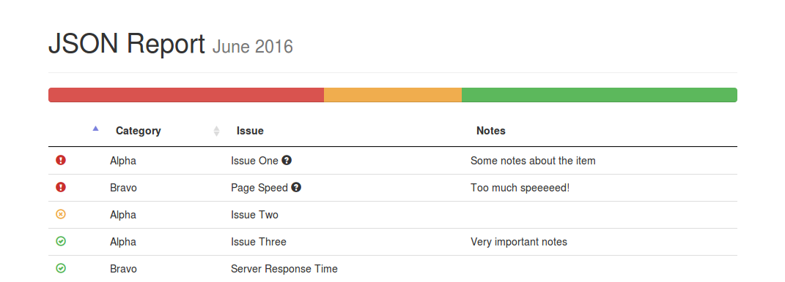

# JSON Report

Turns a JSON object into a nice simple HTML report

## Setup

#### Install Dependencies

```bash
npm install
```

#### Setup JSON Object

Fill the `report.json` with everything you need in your report. See `report.json.example` for the format.

## Screenshot

